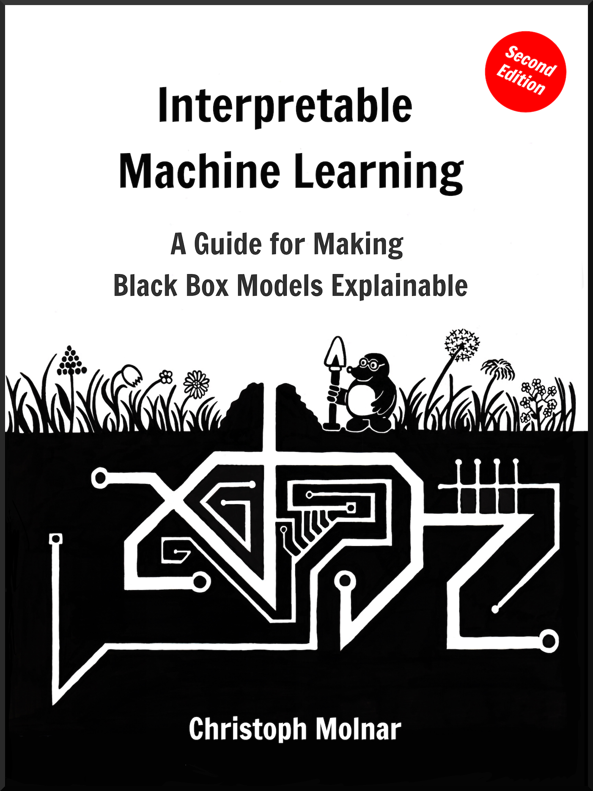

# Résumé

{w=400px align=center}

L'apprentissage automatique représente un grand potentiel pour améliorer les produits, les processus et la recherche. Mais les **ordinateurs n'expliquent généralement pas leurs prédictions**, ce qui est un obstacle à l'adoption de l'apprentissage automatique. Ce livre traite de ce qui rend les modèles d'apprentissage automatique et leurs prédictions interprétables.
<!--
Machine learning has great potential for improving products, processes and research.
But **computers usually do not explain their predictions** which is a barrier to the adoption of machine learning.
This book is about making machine learning models and their decisions interpretable.
-->

Après avoir exploré les concepts d'interprétabilité, vous découvrirez des **modèles simples et interprétables** tels que les arbres de décision, les règles de décision et la régression linéaire. Le livre met l'accent sur les méthodes agnostiques aux modèles pour interpréter **les boîtes noires que sont ces modèles**, tels que l'importance des caractéristiques et les effets locaux accumulés, et pour expliquer les prédictions individuelles avec les valeurs de Shapley et LIME. De plus, le livre présente des méthodes spécifiques aux réseaux de neurones profonds.
<!--
After exploring the concepts of interpretability, you will learn about simple, **interpretable models** such as decision trees, decision rules and linear regression.
The focus of the book is on model-agnostic methods for **interpreting black box models** such as feature importance and accumulated local effects, and explaining individual predictions with Shapley values and LIME.
In addition, the book presents methods specific to deep neural networks.
-->

Toutes les méthodes d'interprétation sont expliquées en profondeur et discutées de manière critique. Comment fonctionnent-elles sous le capot ? Quelles sont leurs forces et leurs faiblesses ? Comment leurs résultats peuvent-ils être interprétés ? Ce livre vous permettra de sélectionner et d'appliquer correctement la méthode d'interprétation la plus adaptée à votre projet d'apprentissage automatique. La lecture du livre est recommandée aux praticiens de l'apprentissage automatique, aux _experts en mégadonnées_, aux statisticiens et à toute autre personne intéressée à rendre des modèles d'apprentissage automatique interprétables.
<!--
All interpretation methods are explained in depth and discussed critically.
How do they work under the hood?
What are their strengths and weaknesses?
How can their outputs be interpreted?
This book will enable you to select and correctly apply the interpretation method that is most suitable for your machine learning project.
Reading the book is recommended for machine learning practitioners, data scientists, statisticians, and anyone else interested in making machine learning models interpretable.
-->

Vous pouvez acheter les versions PDF ou e-book (epub, mobi) [sur leanpub.com](https://leanpub.com/interpretable-machine-learning).

Vous pouvez acheter la version imprimée [sur Amazon](https://www.amazon.fr/dp/B09TMWHVB4).

**Au sujet de l'auteur:** Il s'appelle Christoph Molnar, il est statisticien et spécialiste en apprentissage machine.
My goal is to make machine learning interpretable.

Suivez-le sur X(ex-Twitter)! [\@ChristophMolnar](https://twitter.com/ChristophMolnar)

Couverture de [\@YvonneDoinel](https://twitter.com/YvonneDoinel)

Consultez également [Modeling Mindsets](https://bookgoodies.com/a/B0BMGSF52B), son second livre.

Ce livre est publié sous la licence [Creative Commons Attribution-NonCommercial-ShareAlike 4.0 International License](http://creativecommons.org/licenses/by-nc-sa/4.0/).

**Au sujet du traducteur (assisté de ChatGPT-4):** Mon nom est [Nicolas Guillard](https://www.linkedin.com/in/nicolasguillard/). De formation initiale Ingénieur en informatique, préalablement Analytiste Digital, je suis maintenant Ingénieur en Intelligence Artificielle.
Dernière traduction réalisée entre les 27/12/2023 et **/01/2024.