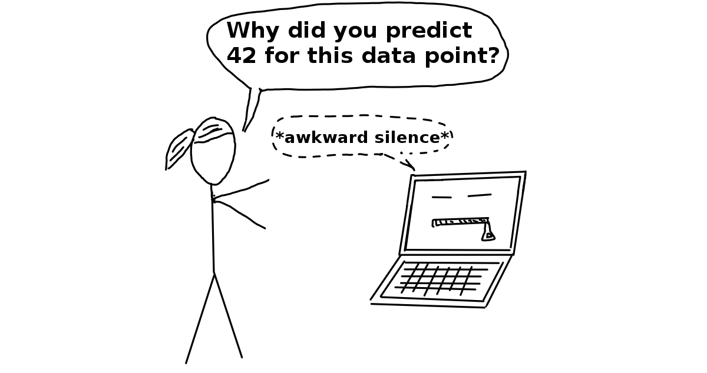

## 2.3 - Terminologie

Pour éviter la confusion due à l'ambiguïté, voici quelques définitions des termes utilisés dans ce livre :
<!--
To avoid confusion due to ambiguity, here are some definitions of terms used in this book:
-->

Un **Algorithme** est un ensemble de règles qu'une machine suit pour atteindre un objectif particulier[^algorithm]. Un algorithme peut être considéré comme une recette qui définit les entrées, la sortie et toutes les étapes nécessaires pour passer des entrées à la sortie. Les recettes de cuisine sont des algorithmes où les ingrédients sont les entrées, la nourriture cuisinée est la sortie, et les étapes de préparation et de cuisson sont les instructions de l'algorithme.
<!--
An **Algorithm** is a set of rules that a machine follows to achieve a particular goal[^algorithm].
An algorithm can be considered as a recipe that defines the inputs, the output and all the steps needed to get from the inputs to the output.
Cooking recipes are algorithms where the ingredients are the inputs, the cooked food is the output, and the preparation and cooking steps are the algorithm instructions.  
-->

**L'apprentissage automatique** (_Machine learning_) est un ensemble de méthodes qui permettent aux ordinateurs d'apprendre à partir de données pour faire et améliorer des prédictions (par exemple, le cancer, les ventes hebdomadaires, le défaut de crédit). L'apprentissage automatique représente un changement de paradigme par rapport à la "programmation normale" où toutes les instructions doivent être explicitement données à l'ordinateur, vers une "programmation indirecte" qui se fait en fournissant des données.
<!--
**Machine Learning** is a set of methods that allow computers to learn from data to make and improve predictions (for example cancer, weekly sales, credit default).
Machine learning is a paradigm shift from "normal programming" where all instructions must be explicitly given to the computer to "indirect programming" that takes place through providing data.
-->

{width=400px align=center}

Un **Apprenant** ou **Algorithme d'apprentissage automatique** est un programme utilisé pour apprendre un modèle d'apprentissage automatique à partir de données. Un autre terme utilisé est "inducteur" (par exemple, "inducteur d'arbres").
<!--
A **Learner** or **Machine Learning Algorithm** is the program used to learn a machine learning model from data.
Another name is "inducer" (e.g. "tree inducer").
-->

Un **Modèle d'apprentissage automatique** est le programme appris qui associe des entrées à des prédictions. Cela peut être un ensemble de poids pour un modèle linéaire ou pour un réseau neuronal. D'autres termes pour le mot plutôt non spécifique "modèle" sont "prédicteur" ou, selon la tâche, "classificateur" ou "modèle de régression". Dans les formules, le modèle d'apprentissage automatique formé est appelé $\hat{f}$ ou $\hat{f}(x)$.
<!--
A **Machine Learning Model** is the learned program that maps inputs to predictions.
This can be a set of weights for a linear model or for a neural network.
Other names for the rather unspecific word "model" are "predictor" or - depending on the task - "classifier" or "regression model".
In formulas, the trained machine learning model is called $\hat{f}$ or $\hat{f}(x)$.
-->

{width=400px align=center}

Un **Modèle boîte noire** est un système qui ne révèle pas ses mécanismes internes. Dans l'apprentissage automatique, "boîte noire" décrit les modèles qui ne peuvent pas être compris en regardant leurs paramètres (par exemple, un réseau neuronal). L'opposé d'une boîte noire est parfois appelé **Boîte Blanche**, et est désigné dans ce livre comme [modèle interprétable](#simple). Les [méthodes agnostiques au modèle](#agnostic) pour l'interprétabilité traitent les modèles d'apprentissage automatique comme des boîtes noires, même s'ils ne le sont pas.
<!--
A **Black Box Model** is a system that does not reveal its internal mechanisms.
In machine learning, "black box" describes models that cannot be understood by looking at their parameters (e.g. a neural network).
The opposite of a black box is sometimes referred to as **White Box**, and is referred to in this book as [interpretable model](#simple).
[Model-agnostic methods](#agnostic) for interpretability treat machine learning models as black boxes, even if they are not.
-->

{width=400px align=center}

**L'apprentissage automatique interprétable** fait référence aux méthodes et modèles qui rendent le comportement et les prédictions des systèmes d'apprentissage automatique compréhensibles pour les humains.
<!--
**Interpretable Machine Learning** refers to methods and models that make the behavior and predictions of machine learning systems understandable to humans.
-->

Un **ensemble de données** est un tableau contenant les données à partir desquelles la machine apprend. L'ensemble de données contient les caractéristiques et la cible à prédire. Lorsqu'il est utilisé pour induire un modèle, l'ensemble de données est appelé données d'entraînement.
<!--
A **Dataset** is a table with the data from which the machine learns.
The dataset contains the features and the target to predict.
When used to induce a model, the dataset is called training data.
-->

Une **Instance** est une ligne dans l'ensemble de données. D'autres noms pour 'instance' sont : point (de données), exemple, observation. Une instance se compose des valeurs des caractéristiques $x^{(i)}$ et, s'il est connu, du résultat cible $y_i$.
<!--
An **Instance** is a row in the dataset. 
Other names for 'instance' are: (data) point, example, observation.
An instance consists of the feature values $x^{(i)}$ and, if known, the target outcome $y_i$.
-->

Les **Caractéristiques** sont les entrées utilisées pour la prédiction ou la classification. Une caractéristique est une colonne dans l'ensemble de données. Tout au long du livre, il est supposé que les caractéristiques sont interprétables, ce qui signifie qu'il est facile de comprendre ce qu'elles signifient, comme la température d'un jour donné ou la taille d'une personne. L'interprétabilité des caractéristiques est une grande supposition. Mais si les caractéristiques d'entrée sont difficiles à comprendre, il est encore plus difficile de comprendre ce que fait le modèle. La matrice avec toutes les caractéristiques est appelée $X$ et $x^{(i)}$ pour une seule instance. Le vecteur d'une seule caractéristique pour toutes les instances est $x_j$ et la valeur pour la caractéristique $j$ et l'instance $i$ est $x^{(i)}_j$.
<!--
The **Features** are the inputs used for prediction or classification.
A feature is a column in the dataset.
Throughout the book, features are assumed to be interpretable, meaning it is easy to understand what they mean, like the temperature on a given day or the height of a person.
The interpretability of the features is a big assumption.
But if it is hard to understand the input features, it is even harder to understand what the model does.
The matrix with all features is called $X$ and $x^{(i)}$ for a single instance.
The vector of a single feature for all instances is $x_j$ and the value for the feature $j$ and instance $i$ is $x^{(i)}_j$.
-->

La **Cible** est l'information que la machine apprend à prédire. Dans les formules mathématiques, la cible est généralement appelée $y$ ou $y_i$ pour une seule instance.
<!--
The **Target** is the information the machine learns to predict. 
In mathematical formulas, the target is usually called $y$ or $y_i$ for a single instance.
-->

Une **Tâche d'apprentissage automatique** est la combinaison d'un ensemble de données avec des caractéristiques et une cible. Selon le type de la cible, la tâche peut être, par exemple, la classification, la régression, l'analyse de survie, le regroupement ou la détection d'anomalies.
<!--
A **Machine Learning Task** is the combination of a dataset with features and a target.
Depending on the type of the target, the task can be for example classification, regression, survival analysis, clustering, or outlier detection.
-->

La **Prédiction** est ce que le modèle d'apprentissage automatique "devine" quelle devrait être la valeur cible en fonction des caractéristiques données. Dans ce livre, la prédiction du modèle est notée $\hat{f}(x^{(i)})$ ou $\hat{y}$.
<!--
The **Prediction** is what the machine learning model "guesses" what the target value should be based on the given features.
In this book, the model prediction is denoted by $\hat{f}(x^{(i)})$ or $\hat{y}$.
-->

[^algorithm]: "Definition of Algorithm."  https://www.merriam-webster.com/dictionary/algorithm. (2017).
